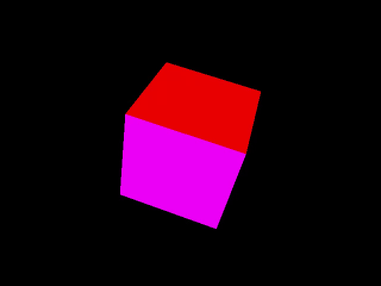

# Rasterizer

Simple software rasterizer that draws a rotating, multi‑colored cube in an SDL 1.2 window. The project is intentionally small so it can be profiled or extended with custom rasterization techniques.

<u>The cube math and rasterization are implemented entirely in pure C with a dash of optional handwritten assembly—no external math or rendering libraries are used for calculating or drawing the cube.</u>

## Demo


## Features
- Pure C implementation with a straightforward half‑space rasterizer
- CPU timing utilities (`chrono.c`) for quick instrumentation
- SDL 1.2 based window, input, and frame buffer handling
- Easily switchable between C and handwritten assembly versions of helper routines

## Prerequisites
- SDL 1.2 development files
- A C compiler (tested with GCC via MSYS2/MinGW on Windows and gcc on Ubuntu)
- Make sure the repo root contains the `buildobjs` directory (or create it)

## Building

### Windows (MSYS2/MinGW64)
1. Install MSYS2 from <https://www.msys2.org/>.
2. Open the **MSYS2 MinGW x64** shell and install the toolchain plus SDL:
   ```sh
   pacman -S --needed mingw-w64-x86_64-toolchain mingw-w64-x86_64-SDL
   ```
3. From the repo directory (`/g/ESAT/3/LowLevel/rasterizer`):
   ```sh
   mkdir -p buildobjs
   x86_64-w64-mingw32-gcc -std=c99 -c -g -Wall -O0 -Dmain=SDL_main -o buildobjs/rasterizer.o rasterizer.c
   x86_64-w64-mingw32-gcc -std=c99 -c -g -Wall -O0 -o buildobjs/chrono.o chrono.c
   x86_64-w64-mingw32-gcc -o rasterizer.exe buildobjs/rasterizer.o buildobjs/chrono.o $(sdl-config --libs) -lm
   ```
4. Copy the runtime DLL next to the executable:
   ```sh
   cp /mingw64/bin/SDL.dll .
   ```

### Linux (Ubuntu)
SDL 1.2 is available via the package manager. Install the dependencies and run the helper script.
```sh
sudo apt update
sudo apt install build-essential libsdl1.2-dev
./compile_ubuntu.sh
```
The script creates `rasterizer.elf` in the repo root.

## Running
From the platform’s shell:
```sh
./rasterizer.exe   # Windows / MSYS2
./rasterizer.elf   # Linux
```
A 640×480 SDL window opens and the cube begins rendering. Keep an SDL window focus and hold any key to let the cube slowly rotate (`g_keydown` toggles the angle update).

## Repository Layout
| Path | Description |
| --- | --- |
| `rasterizer.c` | Main rasterizer and cube rendering logic |
| `chrono.c/.h` | Minimal timing helpers for profiling |
| `sdl_funcs.h` | SDL init, frame, and input utilities |
| `buildobjs/` | Object files created during builds |
| `compile_ubuntu.sh` | Simple gcc build script for Linux |

## Notes
- `ASSEMBLY` flag in `rasterizer.c` shows where you can swap in handcrafted ASM (an example `rasterizer.s` is included).
- CPU frequency for `ChronoShow` defaults to `3400` MHz; adjust `cpu_mhz` for accurate cycle reporting.
- SDL 1.2 is legacy but deliberately used to keep dependencies light. Updating to SDL2 mainly requires touching `sdl_funcs.h`.

